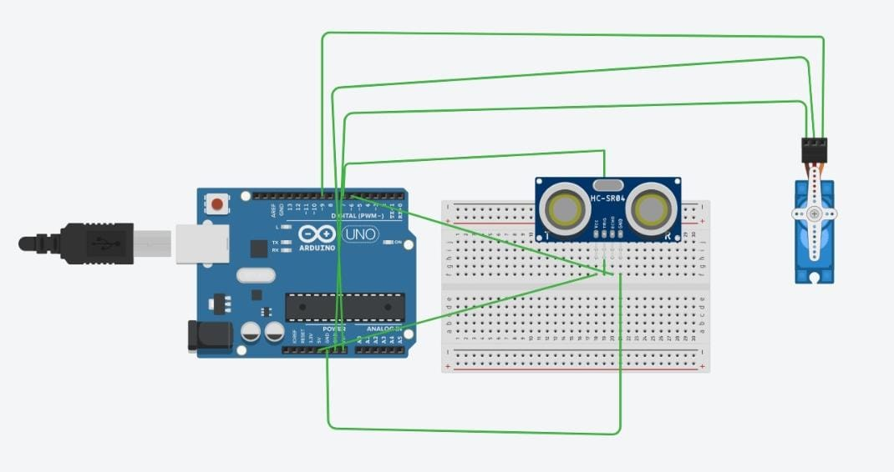
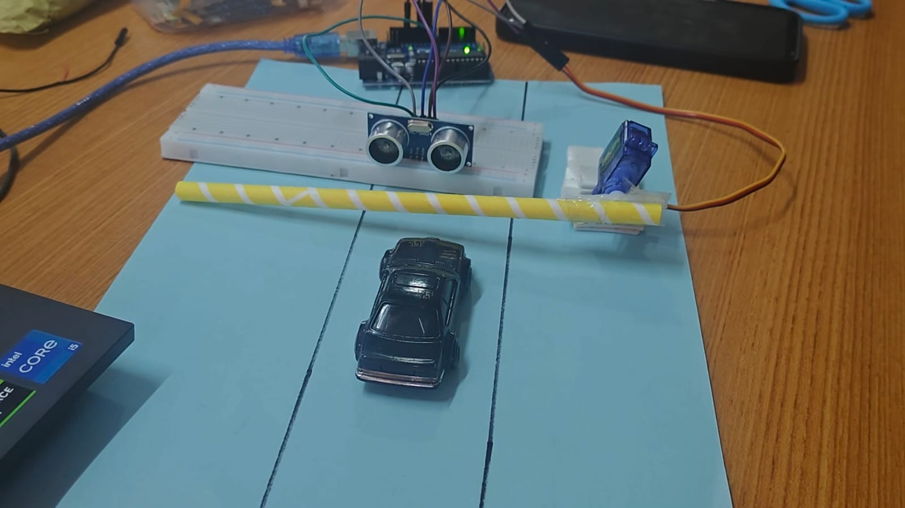

**SMART PARKING SYSTEM**  
**Aim**  
To develop an automatic parking barrier system that detects an approaching vehicle and controls the entrance gate automatically

**Principle**  
The system works using ultrasonic distance measurement. The HC-SR04 detects the distance o he vehicle and Arduino controls the servo moto according to the detected distance

**Components Used**

* Arduino UNO  
* HC-SRO4 Ultrasonic Sensor  
* Servo Motor  
* Breadboard  
* Connecting Wires  
* USB Cable  
* Power Supply  
* Barrier Gate  
* Parking Model

**Procedure**

* Connect the HC-SR04 sensor to the Arduino UNO  
* Connect the servo motor to the Arduino  
* Fix the servo motor vith the parking barrier  
* Place the ultrasonic sensor near the parking entrance.  
* Upload the Arduino program  
* Set a suitable distance for vehicle detection  
* Bring a toy car near the sensor and observe the barrier  
* When the car is detected, the barrier opens automatically.  
* After the car passes, the barrier returns to its original position

**Working**  
       The ultrasonic sensor continuously measures the distance near the entrance. When a vehicle approaches, the sensor detects it Arduino processes the sensor signal. The servo motor rotates and lifts the barrier The vehicle can enter the parking area. After the vehicle passes, the servo motor brings the barrier back to its original position

**Advantages**

- [ ] Reduces manual operation  
- [ ] Provides automatic vehicle entry control  
- [ ] Simple and low-cost system  
- [ ] Saves time at parking entrances  
- [ ] Can be easily implemented in small parking areas.  
- [ ] Uses /Applications  
- [ ] College and office parking  
- [ ] Residential parking  
- [ ] Shopping malls  
- [ ] Private parking areas and Automatic entry gates  
      

**Result**  
The smart parking system successfully detects an approaching vehicle and automatically controls the parking barrier using an ultrasonic sensor, Arduino and servo motor.  
   
**Project Diagram**  
****

**Project result**  
****

